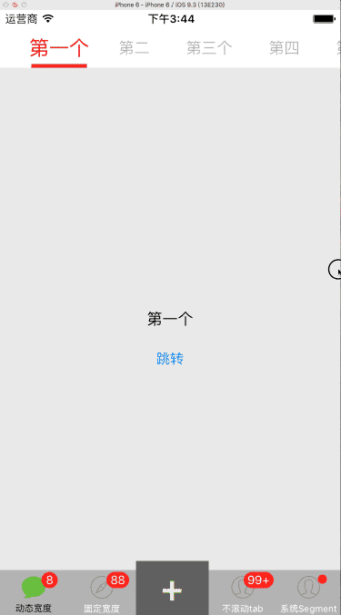
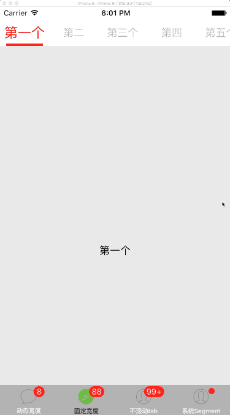
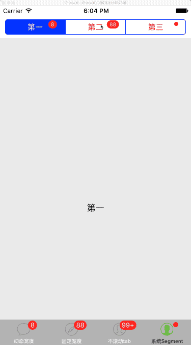
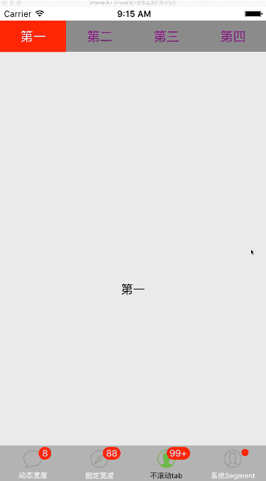

# MSTabBarController
高度自定义的TabBarController

1. 替代系统的UITabBarController，以下属性均可自定义：
a) TabBar：位置、大小、边框、圆角、分割线、内容支持滚动等；
b) TabItem：图像、选中背景、title字体、title颜色等，均包含选中和未选中两种状态；
c) Badge：支持数字badge和小圆点badge，可自定义：位置、大小、背景颜色、背景图像、badge title字体、badge title颜色等；
2. 替代系统的UISegmentControl，且功能更加强大；
3. 仿网易、搜狐等新闻客户端的可滑动的内容视图和TabBar，支持滑动内容视图时，对应TabItem的字体、颜色、选中背景跟随内容视图的滚动进行平滑渐变切换。
